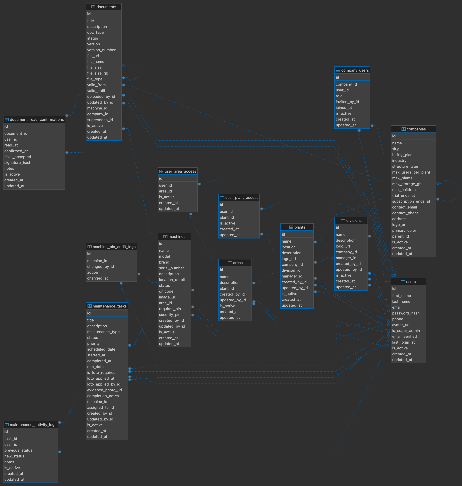

# DocTrack 🏭
### Sistema de Gestión Documental y Trazabilidad Industrial

> *"Cada máquina, cada documento, cada persona — conectados en tiempo real"*

---

## 📋 Tabla de Contenidos

- [Descripción General](#-descripción-general)
- [El Problema](#-el-problema)
- [La Solución](#-la-solución)
- [Tecnologías](#-tecnologías)
- [Instalación y Configuración](#-instalación-y-configuración)
- [Poblar la Base de Datos](#-poblar-la-base-de-datos-seed)
- [Ejecutar el Servidor](#-ejecutar-el-servidor)

---

## 🏢 Descripción General

**DocTrack** es una plataforma **SaaS B2B Multi-Tenant** diseñada específicamente para el sector industrial. Su función principal es:

- Centralizar la **gestión de documentación técnica** de maquinaria.
- Llevar una **trazabilidad inmutable** de las operaciones.
- Administrar los flujos de **mantenimiento** (preventivo, correctivo y predictivo) de forma segura y aislada para múltiples empresas.

---

## ⚠️ El Problema

Las empresas industriales sufren de una gestión de la información ineficiente y riesgosa:

| Problema | Descripción |
|---|---|
| 📂 Dispersión de información | Manuales perdidos en carpetas físicas, Drive o WhatsApp |
| ⏱️ Downtime prolongado | Técnicos tardan demasiado en rastrear historial de fallas |
| 🔍 Falta de trazabilidad | Sin forma de comprobar si un operario leyó las instrucciones |
| 📊 Procesos manuales | Mantenimiento gestionado en Excel o papel |
| 🚨 Riesgo normativo | Certificados que vencen sin que nadie lo note |
| 🔒 Sin control de acceso | Empleados acceden a información que no les corresponde |
| 📵 Desconexión en planta | El operario no tiene acceso rápido a manuales en campo |

---

## 💡 La Solución

DocTrack digitaliza y automatiza el piso de planta mediante:

1. **Acceso Instantáneo vía QR** — Cada máquina tiene un código QR único. El operario lo escanea y accede al instante a todos sus manuales, certificados y tareas.

2. **Trazabilidad Automática** — Registra automáticamente las confirmaciones de lectura: quién leyó, qué documento y en qué fecha exacta.

3. **Mantenimiento Digitalizado** — Flujo completo: creación de tarea por el supervisor → ejecución del técnico → cierre y registro.

4. **Alertas Inteligentes** — Notificaciones proactivas cuando un documento o certificado está próximo a vencer.

5. **Aislamiento Multi-Tenant** — Arquitectura que garantiza que los datos de cada cliente estén 100% separados y seguros.

---

## 🛠️ Tecnologías

- **Backend:** Python 3.12+ / FastAPI
- **Base de datos:** PostgreSQL 15
- **ORM:** SQLAlchemy
- **Autenticación:** JWT (PyJWT / Bcrypt)
- **Configuración:** Pydantic Settings
- **Infraestructura:** Docker / Docker Compose
- **Cache:** Redis 7

---

## 🚀 Instalación y Configuración

### Prerrequisitos

- Python 3.12+
- Docker y Docker Compose
- Git

### 1. Clonar el repositorio

```bash
git clone <url-del-repositorio>
cd ./backend/api
```

### 2. Crear y activar el entorno virtual

```bash
# Crear el entorno virtual
python3 -m venv venv

# Activar (Mac/Linux)
source venv/bin/activate

# Activar (Windows)
venv\Scripts\activate
```

### 3. Instalar dependencias

```bash
# Dentro de backend/api/
pip install -r requirements.txt
```

### 4. Configurar variables de entorno

Crea un archivo `.env` en la raíz de `backend/api/`:

```env
APP_NAME="X"
ENVIRONMENT="X"
DATABASE_URL="X"
SECRET_KEY="tu_super_secreto_seguro_aqui"
ALGORITHM="X"
```

### 5. Levantar los servicios con Docker

Desde `backend/`:

```bash
# Levantar todos los servicios
docker compose up -d

# Bajar todos los servicios
docker compose down

# Verificar que estén corriendo
docker compose ps
```

### 6. Inicializar la base de datos

Ejecuta el script SQL principal en tu gestor de base de datos (DBeaver, pgAdmin, o terminal):

```
backend/schema/create_tables.sql
```

---

## 🌱 Poblar la Base de Datos (Seed)

El proyecto incluye un script de seeding corporativo que inyecta automáticamente:

- ✅ 6 empresas (Carozzi, Nestlé, Coca-Cola, Siemens, Toyota, Bayer)
- ✅ Estructura jerárquica: Plantas → Áreas → Máquinas
- ✅ Usuarios con distintos roles (Admin, Supervisor, Técnico, Operador)
- ✅ Historial de mantenimiento, logs de actividad y documentos técnicos

Ejecutar desde `backend/`:

```bash
docker compose exec -w /app api python -m schema.seed
```

Una vez completado verás las credenciales de acceso principal:

```
🔐 Email:    manuelesD@gmail.com
🔐 Password: DocTrack2027@@
```

> Para los demás administradores: `admin@[dominio]` / `Admin123!`

---

## ▶️ Ejecutar el Servidor

```bash
# Desde backend/api/
uvicorn app.main:app --reload --host 0.0.0.0 --port 8000
```

El flag `--reload` reinicia el servidor automáticamente al detectar cambios en el código.

La API estará disponible en: `http://localhost:8000`

Documentación interactiva: `http://localhost:8000/docs`

---

## 📐 Schema de Base de Datos



---

## 📁 Estructura del Proyecto

```
sharted/
└── backend/
    ├── docker-compose.yml
    ├── api/
    │   ├── Dockerfile
    │   ├── requirements.txt
    │   └── app/
    │       ├── main.py
    │       ├── core/
    │       └── modules/
    │           ├── users/
    │           ├── compañias/
    │           ├── plantas/
    │           ├── maquinas/
    │           ├── documentos/
    │           └── mantenimiento/
    └── schema/
        ├── seed.py
        └── create_tables.sql
```
